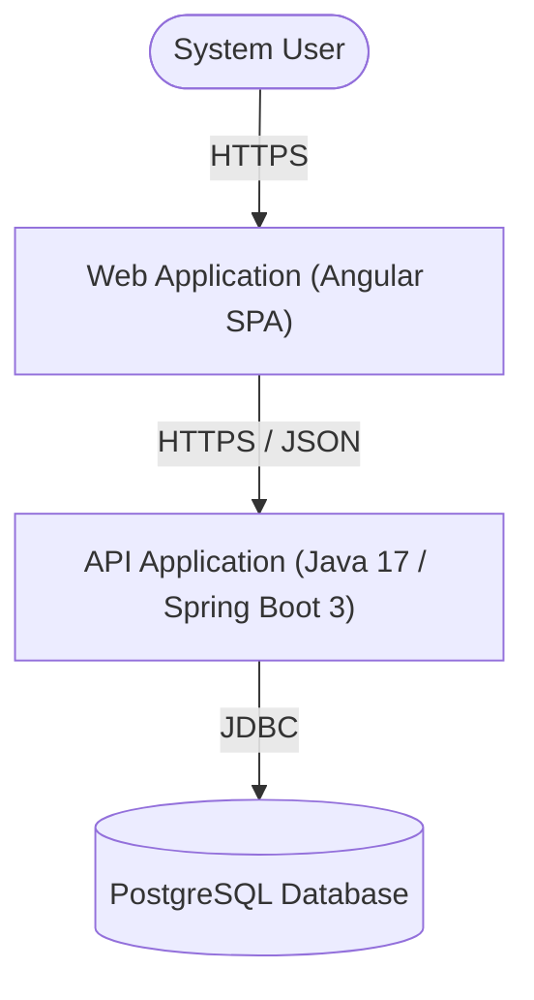
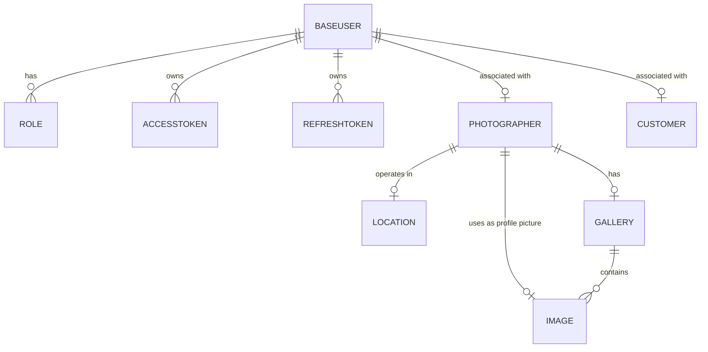

# fotografo.com.vc - Backend API - AI generated
This file was AI generated based on project's report.
> RESTful API backend service for the **fotografo.com.vc** platform, connecting freelance and professional photographers with potential clients. Built with Java and Spring Boot.

---

## Table of Contents
- [Overview](#overview)
- [Architecture & Design](#architecture--design)
- [Tech Stack & Dependencies](#tech-stack--dependencies)
- [Database Model](#database-model)
- [Key Features](#key-features)
- [API Documentation (Swagger)](#api-documentation-swagger)
- [Getting Started](#getting-started)
  - [Prerequisites](#prerequisites)
  - [Configuration](#configuration)
  - [Running the Application](#running-the-application)
  - [Running Tests](#running-tests)
- [CI/CD & Cloud Deployment](#cicd--cloud-deployment)
- [Related Repositories & Links](#related-repositories--links)
- [Author & Academic Credits](#author--academic-credits)

---

## Overview

The **fotografo.com.vc** platform bridges the gap between photographers and clients. According to industry surveys, approximately 47% of photographers practice photography as a hobby or secondary activity alongside their primary careers. While possessing high-quality gear and technical expertise, finding clients is a demanding and time-consuming task.

This backend service provides a robust REST API that allows:
- Photographers to showcase their work by publishing curated photo galleries.
- Photographers to deliver completed jobs directly to clients within the platform.
- Users and clients to perform filtered searches for photographers by city, equipment, and event specialty.

---

## Architecture & Design

The API adheres to the **MVC (Model-View-Controller)** architectural pattern and **SOLID** principles:
- **Presentation Layer (Controllers):** Exposes RESTful endpoints, accepts and validates incoming HTTP requests, and formats JSON responses.
- **Service Layer:** Implements business logic, transaction boundaries, and authorization checks.
- **Persistence Layer (Repositories):** Uses Spring Data JPA repositories interfacing with PostgreSQL over JDBC.
- **Security Layer:** Implements stateless authentication and role-based authorization using Spring Security and JWT.

### C4 Model - System Context



---

## Tech Stack & Dependencies

### Database
- [PostgreSQL](https://www.postgresql.org/): Open-source object-relational database management system.

### Backend Frameworks & Tools
- [Java 17](https://www.oracle.com/java/): Long-Term Support release of the Java platform.
- [Spring Boot 3](https://spring.io/projects/spring-boot/): Framework streamlining enterprise Java application configuration and development.
- [Spring Data](https://spring.io/projects/spring-data/): Abstraction layer for simplified data access across relational stores.
- [Spring Security](https://spring.io/projects/spring-security/): Framework managing authentication and role-based access control.
- [Apache Maven](https://maven.apache.org/): Build automation and dependency management tool.
- [JWT (JSON Web Token)](https://jwt.io/): Open standard for compact, stateless security tokens used in user session authentication.
- [Swagger / OpenAPI](https://swagger.io/): Framework for designing, building, and documenting RESTful APIs.
- [JUnit 5](https://junit.org/junit5/): Core testing framework for automated unit and integration tests.
- [Mockito](https://site.mockito.org/): Mocking library available via `spring-boot-starter-test`.

---

## Database Model



### Core Entities
- `BaseUser` / `Role` / `AccessToken` / `RefreshToken`: Authentication credentials, roles, and session token state (JWT access and refresh tokens).
- `Photographer`: Professional profile with name, gender, biography, contact details, a default `Location`, a portfolio `Gallery`, and a profile picture.
- `Customer`: Client user entity, currently linked to an account with basic name data.
- `Gallery` / `Image`: Showcase portfolio assets (with original and watermarked image bytes and descriptions).
- `Location`: Reference taxonomy entity (city/state) used for listing and finding photographers.

> **Note on scope:** `Equipment`, `Category`, `EventType`, `Job`, `Review`, and `Request` are part of the full product vision documented in the PUC report (functional requirements RF04 and RF14-RF25). They were **documented, not implemented**, in this first iteration of the backend and are therefore absent from the codebase and data model above.

---

## Key Features

As implemented in this first iteration of the backend:

- **Authentication & Security:** Registration for photographers and customers, login, JWT access and refresh token handling, and role-based route protection.
- **Photographer Listing by Location:** Public listing of all photographers and filtering by location (city/state).
- **Portfolio & Gallery Management:** Uploading gallery images, editing image descriptions, deleting images, and viewing galleries and images.
- **Profile Management:** Photographers can update their own profile data and profile picture.

> **Not yet built (documented in the PUC report):** filtered search by equipment category, event specialty, and gender (RF04); taxonomies for equipment, categories, and event types (RF14-RF16, RF21, RF23); job delivery and reviews (RF11, RF19, RF24); admin controls (RF21-RF25); and requests for new taxonomies (RF20, RF25). These are planned for future iterations.

---

## API Documentation (Swagger)

When running the application locally, access the interactive Swagger UI at:
```
http://localhost:8080/fotografocomvc-api/swagger-ui/index.html
```

OpenAPI specification endpoint:
```
http://localhost:8080/fotografocomvc-api/v3/api-docs
```

> Note: the application serves all endpoints under the `fotografocomvc-api` context path (`server.servlet.context-path`).

---

## Getting Started

### Prerequisites
- JDK 17 or later
- Apache Maven 3.8+
- PostgreSQL 14+

### Configuration

The base `src/main/resources/application.properties` is minimal and only defines the active profile and the servlet context path:

```properties
# Active profile
spring.profiles.active=debug

# Context path
server.servlet.context-path=/fotografocomvc-api
```

Database, JPA, Swagger, and upload settings live in per-profile files:

- `application-dev.properties` — local development, pointing to a local PostgreSQL:
```properties
spring.datasource.url=jdbc:postgresql://localhost:5432/fotografocomvc
spring.datasource.username=fotografocomvc
spring.datasource.password=fotografocomvc
spring.jpa.hibernate.ddl-auto=create
spring.servlet.multipart.max-file-size=10MB
spring.servlet.multipart.max-request-size=10MB
```
- `application-debug.properties` — same setup, but pointing to the production **Azure Database for PostgreSQL** (this is the profile enabled by default).
- `application-test.properties` — used by the automated tests.

A `docker-compose.yml` is provided to spin up a local PostgreSQL matching the `dev` credentials:

```bash
docker compose up -d
```

> **JWT configuration:** the JWT secret and access/refresh token expiration are defined as constants in `src/main/java/com/fotografocomvc/api/security/SecurityConstants.java` (`JWT_SECRET`, `ACCESS_TOKEN_EXPIRATION`, `REFRESH_TOKEN_EXPIRATION`). There are no `jwt.*` keys in the property files to override — adjust the constants there instead.

### Running the Application

```bash
# Clone the repository
git clone https://github.com/cmsjulio/fotografocomvc-api.git
cd fotografocomvc-api

# Start a local PostgreSQL (optional)
docker compose up -d

# Build and run with the local 'dev' profile
mvn clean spring-boot:run -Dspring-boot.run.profiles=dev
```

> The default active profile is `debug`, which connects to the production Azure PostgreSQL database. Use the `dev` profile for local development.

### Running Tests

```bash
# Run the test suite
mvn test
```

> The report's requirement of **minimum 80% test coverage (RNF03) is the project-wide target** for the full product, not a guarantee of this first iteration. The current build does not enforce coverage (no coverage plugin configured in `pom.xml`).

---

## CI/CD & Cloud Deployment

- **Backend CI/CD:** GitHub Actions deploying automatically to **Microsoft Azure App Service**.
- **Production Database:** Managed **Azure Database for PostgreSQL**.
- **Frontend Hosting:** Deployed on **Vercel**.
- **Domain:** `fotografo.com.vc`

---

## Related Repositories & Links

- **Frontend Repository (Angular / TypeScript):** [github.com/cmsjulio/fotografocomvc-fe](https://github.com/cmsjulio/fotografocomvc-fe)
- **Live Platform:** [fotografo.com.vc](https://fotografo.com.vc)
- **Presentation Video:** [YouTube Walkthrough](https://youtu.be/RYOlEt37MMQ)

---

## Author & Academic Credits

- **Author:** Júlio Cézar Mendes da Silva
- **Institution:** Pontifícia Universidade Católica de Minas Gerais (PUC Minas Virtual)
- **Program:** Post-graduate Specialization in Software Engineering (*Pós-graduação Lato Sensu em Engenharia de Software*)
- **Year:** 2023
